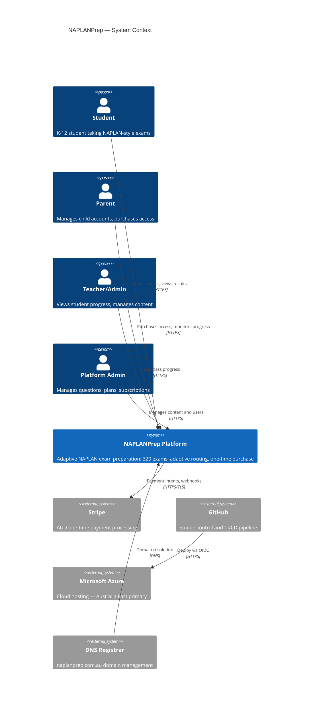
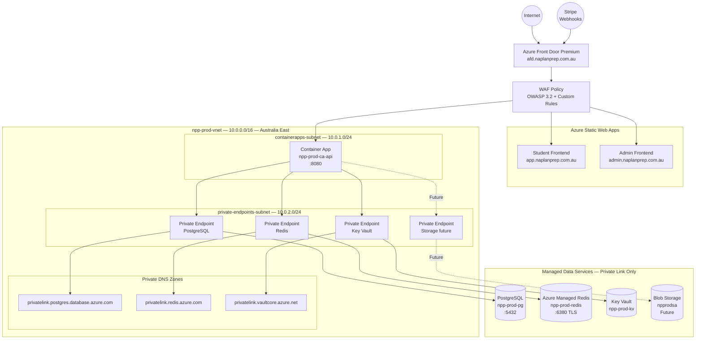

# NAPLANPrep — Azure High Level Design

**Version:** 1.0  
**Date:** 2026-08-16  
**Status:** APPROVED FOR MIGRATION  
**Classification:** Internal — Architecture

---

## 1. Executive Summary

NAPLANPrep is a commercial Australian EdTech platform delivering 320 adaptive NAPLAN-style exam sessions to K-12 students. The platform has completed a full security and functional audit (PRODUCTION_READY = YES) and is migrating from a Railway/Vercel/GHCR deployment to Microsoft Azure.

**Migration objectives:**

| Objective | Detail |
|---|---|
| Data residency | All customer data hosted in Australian Azure regions |
| Security posture | Maintain or exceed current P0/P1/P2-clean security baseline |
| Availability | 99.9% SLA for backend API and frontend serving |
| Operational maturity | Managed services, private networking, Key Vault secrets, structured observability |
| CI/CD continuity | Retain GitHub Actions with OIDC (no long-lived service principal secrets) |
| Zero business disruption | Dual-environment cutover; Railway rollback path kept open until Azure UAT passes |

**Business invariants preserved:**
- 320 published exams (Year 3/5/7/9 = 80 each)
- FREE=20 / ADVANCED=100 / PREMIUM=200 package distribution
- One-time AUD payment (Stripe Mode.PAYMENT)
- Flyway V54–V379 content migrations — untouched
- AUDIO_PRODUCTION_READY = NO (text-only spelling; audio deferred)

---

## 2. Current Architecture

### 2.1 Runtime Components

| Component | Current Platform | Technology |
|---|---|---|
| Backend API | Railway (managed containers) | Spring Boot 3.2.3 / Java 21 |
| Student Frontend | Vercel (serverless edge) | React + Vite / Nginx |
| Admin Frontend | Vercel (serverless edge) | React + Vite / Nginx |
| Container Registry | GHCR (GitHub Container Registry) | Docker images |
| PostgreSQL | Railway managed PostgreSQL | PostgreSQL (Railway-managed version) |
| Redis | Railway managed Redis | Redis (Railway-managed) |
| Secrets | Railway Variables + GitHub Secrets | Mixed — no centralised vault |
| CI/CD | GitHub Actions | YAML workflows |
| DNS | External registrar | naplanprep.com.au |

### 2.2 Current Deployment Flow

```
Developer → Git push → GitHub Actions
                              ↓
                    Build Docker image
                              ↓
                    Push to GHCR (uat-<sha>)
                              ↓
                    Railway GraphQL API → trigger deploy
                              ↓
                    Railway runs container
                              ↓
                    Health gate + DB integrity gate
                              ↓
                    Vercel deploy (frontend + admin)
```

### 2.3 Current Weaknesses

- No private networking between components (Railway internal DNS only)
- Secrets split between Railway Variables and GitHub Secrets (no vault)
- Frontend on Vercel creates cross-region origin for Australian students
- No WAF in front of backend or frontend
- Container registry on GHCR (GitHub) outside Azure governance
- No structured observability (log search, metrics dashboard, alerting)
- Production deploy workflow (deploy-prod.yml) is significantly less mature than UAT workflow

---

## 3. Target Architecture

### 3.1 Azure Resource Overview

| Component | Azure Service | SKU/Tier |
|---|---|---|
| Backend API | Azure Container Apps | Consumption + Dedicated D4 |
| Student Frontend | Azure Static Web Apps | Standard |
| Admin Frontend | Azure Static Web Apps | Standard |
| Container Registry | Azure Container Registry | Premium |
| PostgreSQL | Azure Database for PostgreSQL Flexible Server | General Purpose D4s v3, HA |
| Redis | Azure Managed Redis | Balanced B1 |
| Key Vault | Azure Key Vault | Standard |
| Blob Storage | Azure Blob Storage | LRS (audio future) |
| CDN / Edge / WAF | Azure Front Door Premium | Premium |
| Log Analytics | Azure Log Analytics Workspace | Pay-as-you-go |
| APM | Azure Application Insights | Pay-as-you-go |
| Monitoring | Azure Monitor + Alert Rules | Included |
| Identity | Azure Managed Identity | System-assigned + user-assigned |
| Networking | Azure Virtual Network | Custom |
| DNS (private) | Azure Private DNS Zones | Per-service |

### 3.2 Region Strategy

| Region | Role | Justification |
|---|---|---|
| Australia East (australiaeast) | Primary production | Sydney; availability zones; service coverage; data residency |
| Australia Southeast (australiasoutheast) | DR / geo-redundant backup target | Melbourne; paired region for geo-redundant storage |

**Decision rationale:**
- Azure Australia East (Sydney) is the only Australian region with Availability Zones for zone-redundant PostgreSQL HA
- Azure Australia Southeast (Melbourne) is the Azure-paired region for geo-redundant backup
- Both regions satisfy Australian Privacy Principles (APP) data residency requirement
- Container Apps Dedicated tier with AZ support is available in Australia East
- Azure Managed Redis is available in Australia East
- Azure Front Door Premium global POP provides low latency Australian edge

---

## 4. Context Diagram



---

## 5. Container Diagram

```mermaid
C4Container
    title NAPLANPrep — Azure Container View

    Person(user, "Student/Parent/Admin")

    System_Boundary(afd, "Azure Front Door Premium + WAF") {
        Container(waf, "WAF Policy", "Azure WAF", "SQL injection, XSS, OWASP Top 10, rate anomaly rules")
        Container(cdn, "Edge PoPs", "Azure CDN", "Global edge acceleration, TLS termination, custom domain")
    }

    System_Boundary(swa, "Azure Static Web Apps") {
        Container(frontend, "Student Frontend", "React/Vite SPA", "Exam UI, catalog, results, payment flow")
        Container(admin, "Admin Frontend", "React/Vite SPA", "Content management, analytics, user admin")
    }

    System_Boundary(aca, "Azure Container Apps — npp-prod-ca-env") {
        Container(api, "Backend API", "Spring Boot 3.2.3 / Java 21", "REST API: auth, exams, payments, progress")
    }

    System_Boundary(data, "Azure Data Layer (Private VNet)") {
        ContainerDb(pg, "PostgreSQL Flexible Server", "PostgreSQL 16 HA", "Users, exams, sessions, subscriptions, audit")
        ContainerDb(redis, "Azure Managed Redis", "Redis", "JWT blacklist, rate limiting, Spring cache")
        ContainerDb(kv, "Key Vault", "Azure Key Vault", "Stripe secrets, JWT keys, DB password")
        ContainerDb(storage, "Blob Storage", "Azure Storage", "Audio assets (FUTURE — currently unused)")
    }

    System_Ext(stripe, "Stripe", "AUD one-time payments")
    System_Ext(appinsights, "Application Insights", "APM telemetry")

    Rel(user, afd, "HTTPS requests", "443")
    Rel(afd, frontend, "Static assets", "HTTPS")
    Rel(afd, admin, "Static assets", "HTTPS")
    Rel(afd, api, "API requests via Private Link", "HTTPS → HTTP/8080")
    Rel(api, pg, "JDBC / Hikari pool", "5432 — Private Endpoint")
    Rel(api, redis, "Lettuce / Spring Data Redis", "6380 TLS — Private Endpoint")
    Rel(api, kv, "Managed Identity secret retrieval", "HTTPS — Private Endpoint")
    Rel(api, stripe, "Stripe API calls", "HTTPS outbound")
    Rel(stripe, api, "Webhook delivery", "HTTPS inbound via Front Door")
    Rel(api, appinsights, "Telemetry, traces, metrics", "SDK")
```

---

## 6. Runtime Architecture

### 6.1 Request Flow — Student Exam Session

```
Student Browser
    │
    ▼ HTTPS (naplanprep.com.au)
Azure Front Door Premium
    │ WAF inspection (OWASP + custom rules)
    │
    ├─► Static Web App (student-frontend)
    │       React SPA served from Azure CDN edge
    │
    └─► Container App (npp-prod-ca-api)  [via Private Link origin]
            │
            ├─► JwtAuthenticationFilter (RSA-256 validation)
            ├─► Redis blacklist check (blacklist:{token})
            ├─► RateLimitInterceptor (Redis INCR per IP/group)
            ├─► ExamController → ExamService → SessionRepository
            │       PostgreSQL (private endpoint, Hikari pool)
            ├─► @Cacheable queries → Redis Spring Cache
            └─► Application Insights telemetry
```

### 6.2 Payment Flow

```
Student selects plan → Frontend calls POST /v1/subscriptions/checkout
    │
    ▼
Backend creates Stripe Checkout Session (Mode.PAYMENT, AUD, 1-year validity)
    │
    ▼
Student redirected to Stripe Checkout (Stripe-hosted)
    │
    ▼ Payment succeeds
Stripe calls POST /api.naplanprep.com.au/v1/subscriptions/webhooks/stripe
    │
    ▼ Via Azure Front Door → Container App
Signature verification (Stripe-Webhook-Signature header)
    │
    ▼
handleCheckoutCompleted: payment_status==paid AND mode==payment
    │
    ▼
Idempotency check: findByStripePaymentIntentId
    │
    ▼
User.tags updated: FREE ∪ {ADVANCED|PREMIUM}
    │
    ▼
Student redirected to success URL (frontend)
```

### 6.3 Container App Replica Distribution

- Minimum 2 replicas across 2 availability zones (Azure Container Apps Dedicated tier)
- HTTP/HTTPS ingress via Azure Container Apps built-in load balancer
- Autoscale on HTTP concurrent requests (scale out at >100 concurrent requests per replica)
- Stateless — all session state in PostgreSQL + Redis

---

## 7. Network Topology



### 7.1 VNet Configuration

| Parameter | Value |
|---|---|
| VNet name | npp-prod-vnet |
| VNet CIDR | 10.0.0.0/16 |
| containerapps-subnet | 10.0.1.0/24 — delegated to Microsoft.App/environments |
| private-endpoints-subnet | 10.0.2.0/24 — for all private endpoints |
| Region | Australia East |

### 7.2 Network Security Groups

**npp-prod-nsg-ca (containerapps-subnet):**

| Priority | Direction | Protocol | Port | Source | Destination | Action |
|---|---|---|---|---|---|---|
| 100 | Inbound | TCP | 8080 | AzureFrontDoor.Backend | VirtualNetwork | Allow |
| 200 | Inbound | TCP | 443 | AzureFrontDoor.Backend | VirtualNetwork | Allow |
| 4096 | Inbound | Any | Any | Any | Any | Deny |
| 100 | Outbound | TCP | 5432 | VirtualNetwork | VirtualNetwork | Allow |
| 110 | Outbound | TCP | 6380 | VirtualNetwork | VirtualNetwork | Allow |
| 120 | Outbound | TCP | 443 | VirtualNetwork | Internet | Allow (Stripe/Key Vault) |
| 4096 | Outbound | Any | Any | VirtualNetwork | Any | Deny |

**npp-prod-nsg-pe (private-endpoints-subnet):**

| Priority | Direction | Protocol | Port | Source | Destination | Action |
|---|---|---|---|---|---|---|
| 100 | Inbound | TCP | 5432,6380,443 | VirtualNetwork | VirtualNetwork | Allow |
| 4096 | Inbound | Any | Any | Any | Any | Deny |

---

## 8. Security Architecture

### 8.1 Defence-in-Depth Layers

| Layer | Control | Implementation |
|---|---|---|
| Network perimeter | Azure Front Door WAF | OWASP 3.2 managed rule set, custom rate anomaly rules |
| Transport | TLS 1.2+ enforced | Front Door, Container Apps ingress, private endpoints |
| Application | Spring Security, @PreAuthorize, @EnableMethodSecurity | Role-based access per endpoint |
| Authentication | RSA-256 JWT (PKCS#8), BCrypt(12), Redis blacklist | 900s access / 7d refresh token lifetime |
| Authorization | RBAC: STUDENT, TEACHER, SCHOOL_ADMIN, PLATFORM_ADMIN | Method-level and URL-level guards |
| Secrets | Azure Key Vault, Managed Identity | Zero credentials in code, images, or workflow files |
| Data | Private endpoints for PostgreSQL, Redis, Key Vault | No public internet exposure |
| Rate limiting | Redis-backed per-IP buckets (AUTH 20/min, EXAM_START 10/10min) | Brute force and session flood prevention |
| Container | Non-root user (naplanprep), read-only root FS where practical | Minimal attack surface |
| CI/CD | GitHub OIDC federated identity (no long-lived secrets) | Workload identity federation |
| Identity | Azure Managed Identity for service-to-service auth | No service principal client secrets stored |
| Audit | Spring Slf4j structured JSON logs → Log Analytics | Security event retention 90 days |

### 8.2 Secret Management

| Secret | Source | Storage | Access Method |
|---|---|---|---|
| STRIPE_SECRET_KEY | Stripe Dashboard | Key Vault | Managed Identity → Container App secretRef |
| STRIPE_WEBHOOK_SECRET | Stripe Dashboard | Key Vault | Managed Identity → Container App secretRef |
| STRIPE_ADVANCED_PRICE_ID | Stripe Dashboard | Key Vault | Managed Identity → Container App env |
| STRIPE_PRO_PRICE_ID | Stripe Dashboard | Key Vault | Managed Identity → Container App env |
| JWT_PRIVATE_KEY (PEM) | Generated offline | Key Vault | Managed Identity → Container App secretRef → entrypoint.sh |
| JWT_PUBLIC_KEY (PEM) | Generated offline | Key Vault | Managed Identity → Container App secretRef → entrypoint.sh |
| DATABASE_PASSWORD | Generated | Key Vault | Managed Identity → Container App secretRef |
| REDIS_PASSWORD | Azure Managed Redis | Key Vault | Managed Identity → Container App secretRef |

### 8.3 Identity Model

```
GitHub Actions Workflow
    │ OIDC token (no stored secret)
    ▼
Azure Entra ID — Federated Identity Credential
    │ Exchange for Azure access token
    ▼
Deployment Identity (User-Assigned Managed Identity: npp-prod-mi-deploy)
    ├── ACR Push (AcrPush role on npprodacr)
    ├── Container App update (ContainerApp Contributor on npp-prod-rg-app)
    └── Static Web App deploy (Website Contributor)

Container App Runtime Identity (System-Assigned)
    ├── Key Vault Secrets User (on npp-prod-kv)
    └── ACR Pull (AcrPull role on npprodacr)
```

---

## 9. Data Architecture

### 9.1 PostgreSQL Schema (Key Tables)

| Table Group | Tables | Notes |
|---|---|---|
| Auth | users, user_profiles | BCrypt(12), RBAC roles, account lockout |
| Content | questions, stimuli, writing_content | V54–V379 migrations; DO NOT MODIFY |
| Exam catalogue | exams, sections, testlets, exam_questions, transitions | 320 published exams |
| Sessions | exam_sessions, session_answers, session_snapshots | Adaptive routing state |
| Payments | subscriptions, plans | One-time AUD; idempotency via paymentIntentId |
| Relationships | parent_child_links, school_enrollments | Progress visibility |
| Audit | audit_logs | Security events |

### 9.2 Data Residency

All data stored in Azure Australia East (Sydney). Geo-redundant backup replicates to Azure Australia Southeast (Melbourne) in compliance with Australian Privacy Principles.

### 9.3 Data Classification

| Classification | Data | Protection |
|---|---|---|
| PII-High | Email, name, date of birth, child data | Encrypted at rest, private network, audit logged |
| Payment | Stripe PaymentIntent ID (reference only, no card data) | No raw card data stored (Stripe handles PCI) |
| Content | Questions, answers, explanations | @PreAuthorize on GET /v1/content/questions |
| Session | Exam answers, results | Student-isolated (session ownership checked) |
| Credentials | BCrypt hashes only | Never logged, @JsonIgnore |

---

## 10. Authentication Architecture

### 10.1 JWT Lifecycle

```
POST /v1/auth/login
    │ BCrypt(12) verify
    ▼
Issue access token (RSA-256, 900s) + refresh token (RSA-256, 7d)
    │ Keys loaded from Key Vault via entrypoint.sh → /tmp/jwt/
    ▼
Client stores tokens (currently localStorage — P3-004 DEFERRED)
    │
    ▼ Every authenticated request
JwtAuthenticationFilter:
    1. RSA-256 signature + expiry verification (always enforced)
    2. Redis blacklist check (blacklist:{token}) — if Redis down, allow with log
    3. UserDetailsService.loadUserById → SecurityContextHolder
    │
    ▼ On logout
POST /v1/auth/logout
    Redis: SET blacklist:{accessToken} "1" EX {remaining_ttl}
    │
    ▼ On refresh
POST /v1/auth/refresh
    Validate refresh token → blacklist it → issue new pair
```

### 10.2 Key Management

| Property | Value |
|---|---|
| Algorithm | RSA-256 (PKCS#8 private, X.509 public) |
| Key size | 2048-bit minimum |
| Storage | Azure Key Vault (secret type — PEM content) |
| Loading | entrypoint.sh materialises from env var to /tmp/jwt/private.pem (chmod 600) |
| Rotation | Planned: dual-key overlap period (old + new key both valid during rotation) |
| Ephemeral keys | FORBIDDEN in uat/prod (JwtTokenProvider throws IllegalStateException) |

---

## 11. Payment Architecture

### 11.1 Stripe Integration

| Property | Value |
|---|---|
| Mode | Mode.PAYMENT (one-time, NOT subscription) |
| Currency | AUD |
| Products | NAPLANPrep Advanced, NAPLANPrep Premium |
| Validity | 1 year from purchase date |
| Webhook events | checkout.session.completed, checkout.session.async_payment_succeeded |
| Signature | Stripe-Webhook-Signature verified in parseAndValidate() |
| Idempotency | findByStripePaymentIntentId() deduplication |
| Entitlement | User.tags += {ADVANCED|PREMIUM} after payment_status==paid |

### 11.2 Webhook Security Chain

```
Stripe POST → Front Door → Container App
    │
    RateLimitInterceptor (WEBHOOK bucket: 100/min/IP)
    │
    parseAndValidate():
        secretMissing? → if non-dev: throw BusinessException (HTTP 400)
        else: Webhook.constructEvent(payload, sig, secret)
    │
    handleCheckoutCompleted():
        mode == "payment" AND payment_status == "paid"
        findByStripePaymentIntentId → idempotency check
        User.tags updated
```

---

## 12. Exam Engine Architecture

### 12.1 Catalogue Structure

```
320 Published Exams
├── Year 3 (80)  ├── Year 5 (80)  ├── Year 7 (80)  └── Year 9 (80)
    Each year:
    ├── Numeracy (16)
    ├── Reading (16)
    ├── Writing (16)
    ├── Grammar & Punctuation (16)
    └── Spelling (16)  ← text-only (SHORT_ANSWER), AUDIO_PRODUCTION_READY=NO

Package distribution:
    FREE     = 20 exams  (5 per entitlement)
    ADVANCED = 100 exams (30 total access)
    PREMIUM  = 200 exams (80 total access)
```

### 12.2 Session Lifecycle

```
GET /v1/exams/available → catalog filtered by User.tags
    │
POST /v1/exams/{examId}/start → ExamSession created, first testlet loaded
    │ Rate limited: EXAM_START 10/10min/IP
    │
GET /v1/exams/sessions/{id}/questions → QuestionSummary[] (NO answer fields)
    │ studentView() strips correctAnswer, markingRubric, explanation, transcript
    │
POST /v1/exams/sessions/{id}/answers → answer persisted
    │ Rate limited: EXAM_OPS 200/min/IP
    │
POST /v1/exams/sessions/{id}/testlet/next → adaptive routing via transitions
    │
POST /v1/exams/sessions/{id}/submit → session scored, results calculated
    │
GET /v1/exams/sessions/{id}/results → full results including answers revealed
```

### 12.3 Flyway Migration Constraints

| Constraint | Value |
|---|---|
| Migrations V54–V379 | DO NOT MODIFY (content seeds) |
| validate-on-migrate | true (all environments) |
| repair-on-migrate | false (prod/uat) |
| out-of-order | false (prod/uat) |
| V379 | Converts Spelling AUDIO_RESPONSE → SHORT_ANSWER, audioUrl=NULL |

---

## 13. Adaptive Engine Architecture

### 13.1 Testlet Transition Model

Each exam is divided into testlets. On completion of a testlet, the engine consults the `transitions` table to determine the next testlet based on performance (score band) and prior path.

```
Testlet completed
    │ Calculate score band (from answers in current testlet)
    ▼
transitions table lookup:
    current_testlet_id + score_band → next_testlet_id
    │
    ▼ (if next_testlet_id is null)
Session complete → trigger scoring
```

### 13.2 Calculator Domain Rules

- Numeracy calculator availability configured per testlet in database
- Year 7/9 A-stage Q1–8: calculator UNAVAILABLE
- Year 7/9 A-stage Q9–16: calculator AVAILABLE
- Year 3/5 Numeracy: calculator UNAVAILABLE (per NAPLAN rules)

---

## 14. Caching Architecture

### 14.1 Redis Usage Map

| Purpose | Key Pattern | TTL | Type |
|---|---|---|---|
| JWT blacklist | `blacklist:{token}` | Remaining token lifetime | String (value "1") |
| Refresh blacklist | `blacklist:{refreshToken}` | Remaining refresh lifetime | String |
| Rate limiting | `ratelimit:{GROUP}:{IP}:{window_id}` | window+1 seconds | String (INCR counter) |
| Spring Cache: user details | `userDetails::{userId}` | 5 minutes | JDK serialised |
| Spring Cache: questions | `questions::{cacheKey}` | 30 minutes | JSON |
| Spring Cache: exam catalog | `examCatalog::{key}` | 2 minutes | JSON |

### 14.2 Redis Failure Behaviour (Hardened)

| Component | Redis Down | Behaviour |
|---|---|---|
| JwtAuthenticationFilter | Redis exception caught | Log JWT_BLACKLIST_REDIS_ERROR, allow valid JWT |
| RateLimitInterceptor | Redis exception caught | Log RATE_LIMIT_REDIS_ERROR, allow request |
| AuthService.refresh() | Redis exception caught | Log, skip blacklist check |
| Spring Cache | CacheErrorHandler.handleCacheGetError | Log, fall through to DB |

**Accepted risk:** During Redis outage, recently-revoked tokens may be accepted for up to 900 seconds (access token TTL). Rate limiting is also suspended during outage.

---

## 15. Observability Architecture

### 15.1 Telemetry Stack

```
Container App → Application Insights SDK
    │ Traces, dependencies, exceptions, requests
    ▼
Log Analytics Workspace (npp-prod-law)
    │ Container logs (stdout/stderr)
    │ PostgreSQL server logs
    │ Redis diagnostics
    │ Front Door access logs
    │ NSG flow logs (optional)
    │ Key Vault audit logs
    ▼
Azure Monitor + Alert Rules
    │
    ▼
Alert Actions:
    - Email / SMS (oncall)
    - Slack webhook (team channel)
    - PagerDuty (critical only)
```

### 15.2 Key Metrics

| Metric | Source | Alert Threshold |
|---|---|---|
| Backend request latency p99 | App Insights | > 2000ms |
| Backend 5xx rate | App Insights | > 1% over 5min |
| Backend 401/403 rate | App Insights | > 10% over 5min |
| Container restart count | Container Apps | > 2 restarts in 10min |
| DB connection pool utilisation | App Insights | > 80% |
| Redis errors | App Insights | > 5 errors/min |
| Stripe webhook failure | App Insights (custom event) | > 2 failures/hour |
| Exam start failures | App Insights (custom event) | > 5/min |
| Payment processing failure | App Insights (custom event) | Any |
| CPU (Container App) | Azure Monitor | > 80% sustained 5min |
| Memory (Container App) | Azure Monitor | > 85% |
| PostgreSQL CPU | Azure Monitor | > 80% |
| Front Door 5xx rate | Front Door metrics | > 1% |

### 15.3 Log Retention

| Category | Workspace | Retention |
|---|---|---|
| Security audit events | Log Analytics | 90 days hot, 1 year archive |
| Application logs | Log Analytics | 30 days hot |
| Metrics | Azure Monitor | 93 days |
| PostgreSQL audit | Log Analytics | 90 days |
| Key Vault audit | Log Analytics | 90 days |

---

## 16. CI/CD Architecture

### 16.1 Pipeline Overview

```
Git push to develop/main
    │
GitHub Actions CI (ci.yml)
    ├── Java unit tests (mvn test)
    ├── Frontend tests (vitest run)
    ├── Admin TypeScript check (tsc --noEmit)
    ├── Security/dependency scan (optional: Trivy)
    │
    ▼ (if CI passes)
Build stage:
    ├── Docker build backend (eclipse-temurin:21-jre-alpine)
    ├── Docker build frontend (node:20-alpine → nginx:alpine)
    ├── Docker build admin
    │
    ▼
Push to ACR (npprodacr.azurecr.io):
    ├── npprodacr.azurecr.io/naplanprep-backend:prod-<sha>
    ├── npprodacr.azurecr.io/naplanprep-frontend:prod-<sha>
    └── npprodacr.azurecr.io/naplanprep-admin:prod-<sha>
    │
    ▼ (via OIDC — no stored Azure credentials)
Deploy to Azure Container Apps (backend):
    az containerapp update --image prod-<sha>
    │ Revision-based blue/green traffic split
    │
    ▼
Health gate (poll /actuator/health until UP)
    │
DB integrity gate (authenticate CI account → /actuator/health/dbIntegrity)
    │ Assert: 320 exams, year/package counts, zero empty exams
    │
    ▼ (both gates pass)
Deploy Static Web Apps (frontend + admin)
    │
    ▼
Remote smoke test:
    - /actuator/health → UP
    - /v1/subscriptions/plans → 200
    - register → login → catalog → exam start → question type check
    │
    ▼ (UAT) auto-deploy
    ▼ (PROD) manual approval gate
```

### 16.2 OIDC Identity

```yaml
# No Azure client secrets stored in GitHub
permissions:
  id-token: write
  contents: read

- name: Azure Login
  uses: azure/login@v2
  with:
    client-id: ${{ vars.AZURE_CLIENT_ID }}
    tenant-id: ${{ vars.AZURE_TENANT_ID }}
    subscription-id: ${{ vars.AZURE_SUBSCRIPTION_ID }}
```

---

## 17. Backup / DR Architecture

### 17.1 PostgreSQL Backup

| Property | Value |
|---|---|
| Backup type | Automated (Azure managed) |
| Retention | 35 days |
| Geo-redundant backup | Enabled → Australia Southeast |
| PITR | Yes — restore to any point within retention window |
| HA mode | Zone Redundant (primary AZ1, standby AZ2 — Australia East) |
| Failover | Automatic (60s failover SLA for zone failure) |

### 17.2 Redis

Azure Managed Redis supports AOF persistence and RDB snapshots. However, all NAPLANPrep Redis state is ephemeral (blacklists expire naturally, cache can be rebuilt, rate limit counters reset on restart). Redis does NOT need migration or backup — initialize cleanly in Azure.

### 17.3 Application State

Container Apps are stateless. All persistent state is in PostgreSQL. Redeployment is trivial (pull image from ACR).

### 17.4 RPO / RTO Targets

| Scenario | RPO | RTO |
|---|---|---|
| Container crash / restart | 0 | < 60 seconds (AZ autoheal) |
| Availability zone failure | 0 (HA standby) | < 90 seconds (automatic PostgreSQL failover) |
| Region disaster | < 5 minutes (geo-backup lag) | < 4 hours (restore + redeploy) |
| Redis failure | 0 (stateless) | < 2 minutes (managed recovery) |
| Data corruption | PITR to clean point | < 2 hours (depends on restore size) |

---

## 18. Scaling Strategy

### 18.1 Container Apps Autoscale

| Rule | Trigger | Action |
|---|---|---|
| HTTP scale-out | > 100 concurrent requests per replica | Add 1 replica (max 10) |
| HTTP scale-in | < 20 concurrent requests per replica | Remove 1 replica (min 2) |
| CPU scale-out | CPU > 70% | Add 1 replica |
| Cooldown period | 5 minutes | Prevent oscillation |

### 18.2 PostgreSQL Scaling

| Scenario | Action |
|---|---|
| Connection exhaustion (>80% pool) | Add Connection Pooler (PgBouncer proxy) |
| Read-heavy load | Add read replica (reporting, analytics queries) |
| Storage | Auto-grow enabled (start 128 GiB, max 16 TiB) |
| vCores | Scale up D4s (4 vCores) → D8s (8 vCores) if required |

### 18.3 Capacity Model (10,000 Concurrent Students)

| Resource | Requirement | Target SKU |
|---|---|---|
| Container App replicas | ~20 replicas at 500 req/s | max-replicas: 20 (increase if needed) |
| PostgreSQL connections | 20 per replica × 20 = 400 | D8s + PgBouncer |
| Redis ops/s | ~2000/s (rate limit + cache) | Balanced B2 |
| Front Door RPS | ~5000 | Premium handles elastic |

**Note:** These projections have NOT been load-tested. Load testing is a required gate before claiming 10,000-student capacity support.

---

## 19. Cost Considerations

All pricing is indicative based on Azure Australia East list prices as of 2026. Actual costs depend on usage patterns.

### 19.1 Minimum Production (Low Traffic)

| Resource | SKU | Est. Monthly (AUD) |
|---|---|---|
| Container Apps (Dedicated) | D4, 2 replicas | ~$180 |
| PostgreSQL Flexible Server | General Purpose D4s HA | ~$380 |
| Azure Managed Redis | Balanced B1 | ~$120 |
| Azure Container Registry | Premium | ~$35 |
| Azure Key Vault | Standard | ~$5 |
| Azure Static Web Apps | Standard × 2 | ~$18 |
| Azure Front Door Premium | Base + traffic | ~$90 |
| Log Analytics | ~5 GB/day | ~$35 |
| Application Insights | ~1 GB/day | ~$10 |
| Blob Storage (reserved) | LRS, minimal | ~$5 |
| **Estimated total** | | **~$878/month** |

### 19.2 Cost Drivers

- PostgreSQL HA is the largest fixed cost — zone-redundant standby doubles DB compute cost
- Container Apps Dedicated tier for AZ support adds ~$50/month base vs Consumption plan
- Azure Managed Redis Balanced tier is required for TLS + private endpoint support
- Front Door Premium (vs Standard) required for WAF + private origin connectivity

### 19.3 Cost Optimisation Options

- Use dev Reserved Instances for PostgreSQL (1-year commitment ~35% saving)
- Scale Container Apps to 0 in non-prod environments during off-hours
- Use Azure Defender for Databases budget tier for non-critical environments

---

## 20. Failure Modes

| Failure | Detection | Impact | Mitigation |
|---|---|---|---|
| Container App crash | Liveness probe → restart | < 60s downtime per instance | Min 2 replicas, AZ distribution |
| Redis unavailable | JWT filter catch block | Revoked tokens accepted for ≤900s | Redis HA, accepted risk documented |
| PostgreSQL primary failure | HA monitoring | 60–90s failover | Zone-redundant standby, automatic failover |
| Key Vault unreachable at startup | App fails to start | Deployment blocked | Private endpoint, retry in entrypoint |
| Stripe API unavailable | StripeException in checkout | Payment creation fails; exam access unaffected | Stripe's own SLA (99.99%) |
| Front Door outage | Global health probe | Global access affected | Microsoft SLA 99.99% + DR region |
| Image pull failure | Container Apps event | Deployment blocked | ACR geo-replication (optional), retain previous revision |
| Database migration failure (Flyway) | App fails to start | Deployment blocked | validate-on-migrate=true, CI gate |

---

## 21. Disaster Recovery

### 21.1 DR Sequence (Region Failure)

```
1. Declare DR (PagerDuty alert or manual decision)
2. PostgreSQL geo-restore from Australia Southeast backup → new Flexible Server in secondary region
3. Update Container App environment variable DATABASE_URL to new server
4. Redeploy Container App from ACR (images already in Australian East ACR; optionally geo-replicate ACR)
5. Update Front Door origin to secondary Container App
6. Verify health gate + DB integrity
7. Update DNS CNAME records (Front Door handles via anycast — minimal change)
8. Customer communication
```

### 21.2 DR Testing

- Quarterly: PostgreSQL geo-restore drill to isolated resource group (non-production)
- Semi-annual: full DR simulation (secondary region deployment, smoke test)
- Every deploy: CI/CD health gates serve as continuous recovery validation

---

## 22. Migration Strategy

See `docs/azure/AZURE_MIGRATION_MASTER_PLAN.md` for the full 19-phase plan.

**High-level approach:** Dual-environment migration — Railway/Vercel remains live while Azure UAT is built in parallel. Production cutover is a controlled DNS switch with Railway as the rollback path for 72 hours.

**Critical path:** Phase 5 (PostgreSQL) → Phase 12 (Database Migration) → Phase 13 (UAT) is the longest sequential dependency.

---

## 23. Rollback Strategy

### 23.1 Application Rollback (No DB Involvement)

Container Apps revision-based traffic splitting enables instant rollback:

```bash
# Roll back to previous revision
az containerapp revision set-mode --name npp-prod-ca-api \
  --resource-group npp-prod-rg-app --mode single
az containerapp ingress traffic set --name npp-prod-ca-api \
  --resource-group npp-prod-rg-app \
  --revision-weight previous-revision=100
```

### 23.2 DNS Rollback (Point Back to Railway)

```bash
# Update DNS CNAME api.naplanprep.com.au → Railway domain
# TTL must be set to 60s BEFORE cutover to enable fast rollback
```

### 23.3 Database Rollback

Database rollback is NOT trivial for DML changes. If Flyway migrations run cleanly and data is only added (not destructively modified), restore to Railway from backup is the recovery path. The migration must include a pre-cutover backup and a tested restore procedure.

---

## 24. Non-Functional Requirements

| Requirement | Target | Measurement |
|---|---|---|
| API latency (p50) | < 100ms | Application Insights percentile |
| API latency (p99) | < 500ms | Application Insights percentile |
| Exam start latency (p99) | < 2000ms | Application Insights custom event |
| Availability (API) | ≥ 99.9% monthly | Azure Monitor uptime |
| Availability (Frontend) | ≥ 99.95% | Static Web Apps SLA |
| RTO (zone failure) | < 90 seconds | PostgreSQL HA automatic failover |
| RTO (region failure) | < 4 hours | DR runbook |
| RPO (zone failure) | 0 | Synchronous HA standby |
| RPO (region failure) | < 5 minutes | Geo-redundant backup lag |
| Data residency | Australia | All PII in Australia East / Southeast |
| Security baseline | ASD Essential Eight Maturity Level 1 | Security audit |
| TLS | 1.2 minimum | Front Door policy |
| Secrets | Key Vault only | No plaintext credentials in code/images |
| Password hashing | BCrypt cost 12 | Existing implementation |
| Audit logging | 90 days minimum | Log Analytics retention |
| GDPR / APP compliance | Australian Privacy Principles | Data classification + residency |
