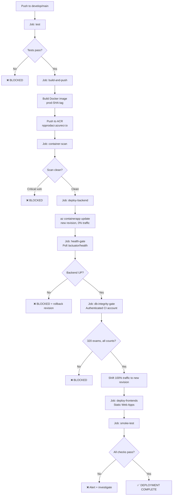

# LLD — Azure CI/CD Pipeline

**Project:** NAPLANPrep  
**Version:** 1.0  
**Date:** 2026-08-16  
**Status:** Draft — Pre-Implementation

---

## 1. Overview

This document defines the low-level design of the GitHub Actions CI/CD pipeline for deploying NAPLANPrep to Azure. It replaces the current Railway GraphQL API / Vercel CLI deployment model with Azure OIDC-authenticated deployments targeting Azure Container Apps (backend) and Azure Static Web Apps (frontends).

The pipeline preserves all existing quality gates: unit tests, Docker build, health polling, authenticated DB integrity gate, and remote smoke tests. No gate is weakened or removed.

---

## 2. Pipeline Architecture



---

## 3. GitHub Environments

| Environment | Branch Trigger | Approval Required | Azure Target |
|---|---|---|---|
| `dev` | Any feature branch (manual) | No | npp-dev-* resources |
| `uat` | Push to `develop` | No | npp-uat-* resources |
| `prod` | Push to `main` after CI | **Yes — 1 required reviewer** | npp-prod-* resources |

Production deployments require a GitHub Environment protection rule with at least one required reviewer before the deployment job runs.

---

## 4. Azure OIDC Authentication

### 4.1 Federated Credential Setup

Replace all stored Azure client secrets with OIDC federation. No `AZURE_CLIENT_SECRET` stored in GitHub.

```bash
# Create App Registration (or use user-assigned Managed Identity)
APP_ID=$(az ad app create --display-name "naplanprep-github-actions" \
  --query appId -o tsv)

# Create service principal
az ad sp create --id $APP_ID

# Assign Contributor role on resource groups
az role assignment create \
  --assignee $APP_ID \
  --role Contributor \
  --scope /subscriptions/{SUB_ID}/resourceGroups/npp-prod-rg-app

az role assignment create \
  --assignee $APP_ID \
  --role AcrPush \
  --scope /subscriptions/{SUB_ID}/resourceGroups/npp-prod-rg-app/providers/Microsoft.ContainerRegistry/registries/npprodacr

# Create federated credentials — one per environment
az ad app federated-credential create --id $APP_ID --parameters '{
  "name": "naplanprep-prod",
  "issuer": "https://token.actions.githubusercontent.com",
  "subject": "repo:YOUR_ORG/naplanprep:environment:prod",
  "description": "Production deployment from GitHub Actions",
  "audiences": ["api://AzureADTokenExchange"]
}'

az ad app federated-credential create --id $APP_ID --parameters '{
  "name": "naplanprep-uat",
  "issuer": "https://token.actions.githubusercontent.com",
  "subject": "repo:YOUR_ORG/naplanprep:ref:refs/heads/develop",
  "description": "UAT deployment from GitHub Actions",
  "audiences": ["api://AzureADTokenExchange"]
}'
```

### 4.2 GitHub Secrets Required

| Secret Name | Value | Notes |
|---|---|---|
| `AZURE_CLIENT_ID` | App Registration client ID | Not a secret — can be a variable |
| `AZURE_TENANT_ID` | Azure AD tenant ID | Not a secret — can be a variable |
| `AZURE_SUBSCRIPTION_ID` | Azure subscription ID | Not a secret — can be a variable |
| `CI_SERVICE_EMAIL` | CI PLATFORM_ADMIN email | For DB integrity gate |
| `CI_SERVICE_PASSWORD` | CI PLATFORM_ADMIN password | For DB integrity gate |
| `STRIPE_TEST_PUBLISHABLE_KEY` | Stripe test publishable key | UAT frontend build arg |
| `STRIPE_LIVE_PUBLISHABLE_KEY` | Stripe live publishable key | Prod frontend build arg |
| `SLACK_WEBHOOK` | Slack notification URL | Optional |

**Note:** All Stripe secret keys, webhook secrets, JWT keys, and DB passwords are in Azure Key Vault — NOT in GitHub Secrets.

---

## 5. Image Tagging Strategy

| Environment | Tag Format | Example | Mutable? |
|---|---|---|---|
| UAT | `uat-{sha:8}` | `uat-3525e8e` | No |
| Production | `prod-{sha:8}` | `prod-024d4b0` | No |
| Latest alias | `uat-latest` / `prod-latest` | `prod-latest` | Yes (alias only) |

The Container App always references the immutable `prod-{sha}` tag. The `prod-latest` alias is convenience only and never used as the deployed reference.

---

## 6. Workflow: UAT Deploy (`deploy-uat-azure.yml`)

```yaml
name: Deploy — UAT (Azure)

on:
  push:
    branches: [develop]

env:
  ACR_NAME: nppuatacr
  BACKEND_IMAGE: nppuatacr.azurecr.io/naplanprep-backend
  CONTAINER_APP: npp-uat-ca-api
  CONTAINER_APP_ENV: npp-uat-ca-env
  RESOURCE_GROUP: npp-uat-rg-app
  FRONTEND_SWA: npp-uat-swa-frontend
  ADMIN_SWA: npp-uat-swa-admin
  UAT_API_URL: https://api-uat.naplanprep.com.au/v1
  UAT_ACTUATOR_URL: https://api-uat.naplanprep.com.au

permissions:
  id-token: write   # Required for OIDC
  contents: read

jobs:
  test:
    name: Test
    runs-on: ubuntu-latest
    steps:
      - uses: actions/checkout@v4.2.2

      - name: Set up Java 21
        uses: actions/setup-java@v4
        with:
          java-version: '21'
          distribution: 'temurin'
          cache: maven

      - name: Run backend tests
        run: cd backend && mvn test --no-transfer-progress
        # 4 Testcontainer failures are expected in CI (Docker not available)
        # All other 128 tests must pass

      - name: Run frontend tests + typecheck
        run: |
          cd frontend && npm ci && npx tsc --noEmit && npx vitest run

      - name: Run admin typecheck
        run: |
          cd admin-panel && npm ci && npx tsc --noEmit

  build-and-push:
    name: Build & Push to ACR
    runs-on: ubuntu-latest
    needs: test
    outputs:
      image-tag: ${{ steps.tag.outputs.tag }}
    steps:
      - uses: actions/checkout@v4.2.2

      - name: Azure Login (OIDC)
        uses: azure/login@v2
        with:
          client-id: ${{ vars.AZURE_CLIENT_ID }}
          tenant-id: ${{ vars.AZURE_TENANT_ID }}
          subscription-id: ${{ vars.AZURE_SUBSCRIPTION_ID }}

      - name: Set image tag
        id: tag
        run: echo "tag=uat-$(git rev-parse --short HEAD)" >> $GITHUB_OUTPUT

      - name: Login to ACR
        run: az acr login --name ${{ env.ACR_NAME }}

      - name: Set up Docker Buildx
        uses: docker/setup-buildx-action@v3

      - name: Build & push backend
        uses: docker/build-push-action@v6
        with:
          context: ./backend
          push: true
          tags: |
            ${{ env.BACKEND_IMAGE }}:${{ steps.tag.outputs.tag }}
            ${{ env.BACKEND_IMAGE }}:uat-latest
          cache-from: type=gha
          cache-to: type=gha,mode=max

  container-scan:
    name: Container Vulnerability Scan
    runs-on: ubuntu-latest
    needs: build-and-push
    steps:
      - name: Azure Login (OIDC)
        uses: azure/login@v2
        with:
          client-id: ${{ vars.AZURE_CLIENT_ID }}
          tenant-id: ${{ vars.AZURE_TENANT_ID }}
          subscription-id: ${{ vars.AZURE_SUBSCRIPTION_ID }}

      - name: Scan image with Trivy
        uses: aquasecurity/trivy-action@master
        with:
          image-ref: ${{ env.BACKEND_IMAGE }}:${{ needs.build-and-push.outputs.image-tag }}
          format: 'sarif'
          output: 'trivy-results.sarif'
          severity: 'CRITICAL'
          exit-code: '1'   # Fail on CRITICAL vulnerabilities

  deploy-backend:
    name: Deploy Backend (Container App)
    runs-on: ubuntu-latest
    needs: [build-and-push, container-scan]
    environment: uat
    steps:
      - name: Azure Login (OIDC)
        uses: azure/login@v2
        with:
          client-id: ${{ vars.AZURE_CLIENT_ID }}
          tenant-id: ${{ vars.AZURE_TENANT_ID }}
          subscription-id: ${{ vars.AZURE_SUBSCRIPTION_ID }}

      - name: Deploy new revision (0% traffic)
        run: |
          TAG="${{ needs.build-and-push.outputs.image-tag }}"
          IMAGE="${{ env.BACKEND_IMAGE }}:$TAG"
          
          # Update image — creates a new revision, 0% traffic by default
          az containerapp update \
            --name ${{ env.CONTAINER_APP }} \
            --resource-group ${{ env.RESOURCE_GROUP }} \
            --image "$IMAGE" \
            --revision-suffix "git-${TAG}"

  health-gate:
    name: Health Gate
    runs-on: ubuntu-latest
    needs: deploy-backend
    steps:
      - name: Azure Login (OIDC)
        uses: azure/login@v2
        with:
          client-id: ${{ vars.AZURE_CLIENT_ID }}
          tenant-id: ${{ vars.AZURE_TENANT_ID }}
          subscription-id: ${{ vars.AZURE_SUBSCRIPTION_ID }}

      - name: Poll new revision health (30s startup, 8 min max)
        run: |
          REVISION="${{ env.CONTAINER_APP }}--git-${{ needs.build-and-push.outputs.image-tag }}"
          # Get revision-specific FQDN for health check before traffic switch
          REVISION_FQDN=$(az containerapp revision show \
            --name ${{ env.CONTAINER_APP }} \
            --resource-group ${{ env.RESOURCE_GROUP }} \
            --revision "$REVISION" \
            --query "properties.fqdn" -o tsv 2>/dev/null || echo "")
          
          # Fallback: poll the main FQDN (if multiple revisions share ingress)
          HEALTH_URL="${{ env.UAT_ACTUATOR_URL }}/actuator/health"
          
          echo "Waiting 30s for Tomcat startup..."
          sleep 30
          
          for i in $(seq 1 24); do
            HTTP=$(curl -s -o /tmp/health.json -w "%{http_code}" --max-time 15 "$HEALTH_URL" || echo "000")
            STATUS=$(python3 -c "import json; print(json.load(open('/tmp/health.json')).get('status',''))" 2>/dev/null || echo "")
            echo "Attempt $i/24 — HTTP $HTTP — status: ${STATUS:-?}"
            if [ "$HTTP" = "200" ] && [ "$STATUS" = "UP" ]; then
              echo "BACKEND_HEALTH = PASS"
              exit 0
            fi
            sleep 20
          done
          echo "TIMEOUT: Backend did not reach UP within 8 minutes"
          exit 1

  db-integrity-gate:
    name: DB Integrity Gate
    runs-on: ubuntu-latest
    needs: health-gate
    env:
      CI_SERVICE_EMAIL: ${{ secrets.CI_SERVICE_EMAIL }}
      CI_SERVICE_PASSWORD: ${{ secrets.CI_SERVICE_PASSWORD }}
    steps:
      - name: Authenticate and validate DB integrity
        run: |
          API_BASE_URL="${{ env.UAT_API_URL }}"
          ACTUATOR_BASE_URL="${{ env.UAT_ACTUATOR_URL }}"

          # Login with CI PLATFORM_ADMIN account
          printf '{"email":"%s","password":"%s"}' "$CI_SERVICE_EMAIL" "$CI_SERVICE_PASSWORD" > /tmp/.ci_login.json
          LOGIN_HTTP=$(curl -s -o /tmp/.ci_resp.json -w "%{http_code}" \
            -X POST "$API_BASE_URL/auth/login" \
            -H "Content-Type: application/json" \
            --data @/tmp/.ci_login.json)
          rm -f /tmp/.ci_login.json

          if [ "$LOGIN_HTTP" != "200" ]; then
            echo "FAIL: CI login returned HTTP $LOGIN_HTTP"
            exit 1
          fi

          CI_JWT=$(python3 -c "import json; print(json.load(open('/tmp/.ci_resp.json')).get('data',{}).get('accessToken',''))")
          rm -f /tmp/.ci_resp.json
          echo "::add-mask::$CI_JWT"

          HTTP=$(curl -s -o /tmp/integrity.json -w "%{http_code}" \
            -H "Authorization: Bearer $CI_JWT" \
            "$ACTUATOR_BASE_URL/actuator/health/dbIntegrity")

          python3 << 'EOF'
          import json, sys
          with open('/tmp/integrity.json') as f:
              data = json.load(f)
          details = data.get('details', {})
          checks = {
              'published_total': 320,
              'year_3': 80, 'year_5': 80, 'year_7': 80, 'year_9': 80,
              'package_FREE': 20, 'package_ADVANCED': 100, 'package_PREMIUM': 200,
              'year_domain_pairs_wrong_count': 0,
              'published_without_questions': 0,
              'audio_response_spelling': 0,
          }
          failures = []
          for key, expected in checks.items():
              actual = details.get(key)
              if actual is None or int(actual) != expected:
                  failures.append(f"FAIL: {key} expected={expected} actual={actual}")
              else:
                  print(f"  PASS: {key} = {actual}")
          if failures:
              print("\nDB_INTEGRITY_GATE = FAIL")
              for f in failures: print(f"  {f}")
              sys.exit(1)
          print("\nDB_INTEGRITY_GATE = PASS — all 320 exams verified")
          EOF

  shift-traffic:
    name: Shift 100% Traffic to New Revision
    runs-on: ubuntu-latest
    needs: db-integrity-gate
    steps:
      - name: Azure Login (OIDC)
        uses: azure/login@v2
        with:
          client-id: ${{ vars.AZURE_CLIENT_ID }}
          tenant-id: ${{ vars.AZURE_TENANT_ID }}
          subscription-id: ${{ vars.AZURE_SUBSCRIPTION_ID }}

      - name: Activate new revision
        run: |
          TAG="${{ needs.build-and-push.outputs.image-tag }}"
          az containerapp ingress traffic set \
            --name ${{ env.CONTAINER_APP }} \
            --resource-group ${{ env.RESOURCE_GROUP }} \
            --revision-weight "latest=100"

  deploy-frontends:
    name: Deploy Frontend & Admin (Static Web Apps)
    runs-on: ubuntu-latest
    needs: shift-traffic
    steps:
      - uses: actions/checkout@v4.2.2

      - name: Azure Login (OIDC)
        uses: azure/login@v2
        with:
          client-id: ${{ vars.AZURE_CLIENT_ID }}
          tenant-id: ${{ vars.AZURE_TENANT_ID }}
          subscription-id: ${{ vars.AZURE_SUBSCRIPTION_ID }}

      - name: Deploy Student Frontend
        uses: Azure/static-web-apps-deploy@v1
        with:
          azure_static_web_apps_api_token: ${{ secrets.UAT_SWA_FRONTEND_TOKEN }}
          repo_token: ${{ secrets.GITHUB_TOKEN }}
          action: upload
          app_location: frontend
          output_location: dist
          app_build_command: npm run build
        env:
          VITE_API_URL: ${{ env.UAT_API_URL }}
          VITE_STRIPE_KEY: ${{ secrets.STRIPE_TEST_PUBLISHABLE_KEY }}

      - name: Deploy Admin Panel
        uses: Azure/static-web-apps-deploy@v1
        with:
          azure_static_web_apps_api_token: ${{ secrets.UAT_SWA_ADMIN_TOKEN }}
          repo_token: ${{ secrets.GITHUB_TOKEN }}
          action: upload
          app_location: admin-panel
          output_location: dist
          app_build_command: npm run build
        env:
          VITE_API_URL: ${{ env.UAT_API_URL }}
```

---

## 7. Production Deployment

Production workflow is identical in structure with these differences:

| Item | UAT | Production |
|---|---|---|
| Branch trigger | `develop` | `main` (after CI) |
| ACR | `nppuatacr` | `npprodacr` |
| Container App | `npp-uat-ca-api` | `npp-prod-ca-api` |
| Resource Group | `npp-uat-rg-app` | `npp-prod-rg-app` |
| API URL | `api-uat.naplanprep.com.au` | `api.naplanprep.com.au` |
| Stripe key | `STRIPE_TEST_PUBLISHABLE_KEY` | `STRIPE_LIVE_PUBLISHABLE_KEY` |
| Environment | `uat` | `prod` (requires approval) |
| Image tag | `uat-{sha}` | `prod-{sha}` |
| SWA tokens | `UAT_SWA_*_TOKEN` | `PROD_SWA_*_TOKEN` |

---

## 8. Rollback Procedure

### 8.1 Application Rollback (< 60 seconds)

```bash
# List recent revisions
az containerapp revision list \
  --name npp-prod-ca-api \
  --resource-group npp-prod-rg-app \
  --query "[].{name:name,active:properties.active,traffic:properties.trafficWeight}" \
  --output table

# Shift 100% traffic to previous revision
az containerapp ingress traffic set \
  --name npp-prod-ca-api \
  --resource-group npp-prod-rg-app \
  --revision-weight PREVIOUS_REVISION_NAME=100 NEW_REVISION_NAME=0
```

### 8.2 Frontend Rollback

```bash
# List Static Web Apps deployment history
az staticwebapp environment list \
  --name npp-prod-swa-frontend \
  --resource-group npp-prod-rg-app

# Redeploy previous build via GitHub Actions re-run of prior workflow
```

---

## 9. Gate Summary

| Gate | Blocks What | Failure Action |
|---|---|---|
| Unit tests (128 pass) | Everything | Fix code, re-push |
| TypeScript typecheck | Everything | Fix types, re-push |
| Container scan (CRITICAL) | Backend deploy | Fix vulnerability or accept with justification |
| Backend health (/actuator/health UP) | DB integrity gate, traffic shift | Rollback revision |
| DB integrity gate (320 exams) | Traffic shift, frontend deploy | Investigate DB, do NOT deploy |
| Smoke test | Final sign-off | Alert, investigate |

---

## 10. Container App Environment Variables

All secrets are referenced from Key Vault using Container Apps secretRef syntax. Plain config is set directly.

```yaml
# Container App environment variable configuration
env:
  - name: SPRING_PROFILES_ACTIVE
    value: prod
  - name: SERVER_PORT
    value: "8080"
  # Database — via Key Vault secret
  - name: DATABASE_URL
    secretRef: database-url
  - name: DB_USERNAME
    value: naplanprep_app
  - name: DB_PASSWORD
    secretRef: db-password
  # Redis — via Key Vault secret
  - name: REDIS_HOST
    secretRef: redis-host
  - name: REDIS_PASSWORD
    secretRef: redis-password
  # JWT — entrypoint.sh reads these and writes to /tmp/jwt/
  - name: JWT_PRIVATE_KEY
    secretRef: jwt-private-key
  - name: JWT_PUBLIC_KEY
    secretRef: jwt-public-key
  # Stripe — from Key Vault
  - name: STRIPE_SECRET_KEY
    secretRef: stripe-secret-key
  - name: STRIPE_PUBLISHABLE_KEY
    value: pk_live_...   # Not secret — publishable key
  - name: STRIPE_WEBHOOK_SECRET
    secretRef: stripe-webhook-secret
  - name: STRIPE_ADVANCED_PRICE_ID
    secretRef: stripe-advanced-price-id
  - name: STRIPE_PRO_PRICE_ID
    secretRef: stripe-pro-price-id
  # CI service account — used by DB integrity gate CI job
  - name: CI_SERVICE_EMAIL
    secretRef: ci-service-email
  - name: CI_SERVICE_PASSWORD
    secretRef: ci-service-password
```

---

## 11. Secret References (Key Vault)

Container App references secrets stored in Azure Key Vault via the Container Apps secrets mechanism and Key Vault references:

```bash
az containerapp secret set \
  --name npp-prod-ca-api \
  --resource-group npp-prod-rg-app \
  --secrets \
    "database-url=keyvaultref:https://npp-prod-kv.vault.azure.net/secrets/DATABASE-URL,identityref:/subscriptions/{sub}/resourceGroups/npp-prod-rg-security/providers/Microsoft.ManagedIdentity/userAssignedIdentities/npp-prod-id-api" \
    "db-password=keyvaultref:https://npp-prod-kv.vault.azure.net/secrets/DB-PASSWORD,identityref:..." \
    "jwt-private-key=keyvaultref:https://npp-prod-kv.vault.azure.net/secrets/JWT-PRIVATE-KEY,identityref:..." \
    "jwt-public-key=keyvaultref:https://npp-prod-kv.vault.azure.net/secrets/JWT-PUBLIC-KEY,identityref:..." \
    "stripe-secret-key=keyvaultref:https://npp-prod-kv.vault.azure.net/secrets/STRIPE-SECRET-KEY,identityref:..." \
    "stripe-webhook-secret=keyvaultref:https://npp-prod-kv.vault.azure.net/secrets/STRIPE-WEBHOOK-SECRET,identityref:..." \
    "stripe-advanced-price-id=keyvaultref:https://npp-prod-kv.vault.azure.net/secrets/STRIPE-ADVANCED-PRICE-ID,identityref:..." \
    "stripe-pro-price-id=keyvaultref:https://npp-prod-kv.vault.azure.net/secrets/STRIPE-PRO-PRICE-ID,identityref:..." \
    "redis-host=keyvaultref:https://npp-prod-kv.vault.azure.net/secrets/REDIS-HOST,identityref:..." \
    "redis-password=keyvaultref:https://npp-prod-kv.vault.azure.net/secrets/REDIS-PASSWORD,identityref:..."
```

---

## 12. Health Probe Configuration

```bash
az containerapp update \
  --name npp-prod-ca-api \
  --resource-group npp-prod-rg-app \
  --set-env-vars SPRING_PROFILES_ACTIVE=prod \
  --startup-probe-path /actuator/health \
  --startup-probe-initial-delay 30 \
  --startup-probe-failure-threshold 10 \
  --startup-probe-period 10 \
  --liveness-probe-path /actuator/health \
  --liveness-probe-period 30 \
  --liveness-probe-failure-threshold 3 \
  --readiness-probe-path /actuator/health \
  --readiness-probe-period 10 \
  --readiness-probe-failure-threshold 3
```

---

## 13. Logging and Observability

All Container App stdout/stderr is automatically collected by Log Analytics. Application Insights SDK (if added) provides distributed tracing. Key log queries:

```kusto
// Backend 5xx errors
ContainerAppConsoleLogs
| where ContainerName == "npp-prod-ca-api"
| where Log contains "ERROR" or Log contains "5xx"
| project TimeGenerated, Log
| order by TimeGenerated desc

// Deployment events
ContainerAppSystemLogs
| where ResourceId contains "npp-prod-ca-api"
| where Category == "DeploymentLogs"
| project TimeGenerated, OperationName, Message
| order by TimeGenerated desc
```
