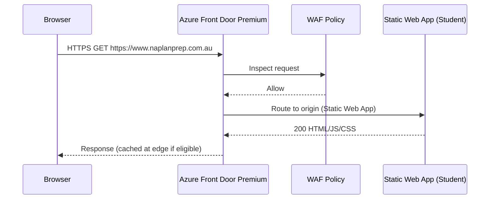
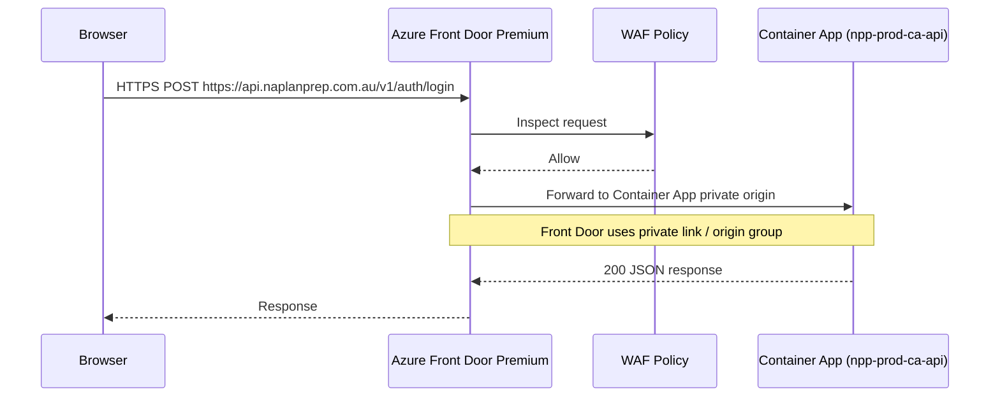
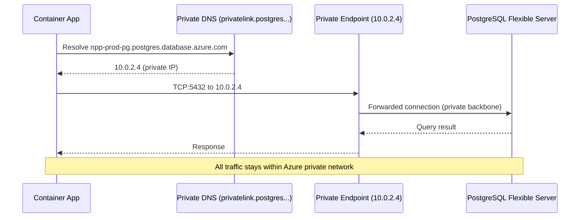
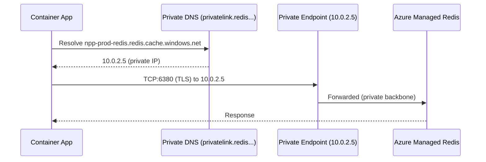

# LLD — Azure Network Architecture
## NAPLANPrep Production

**Version:** 1.0  
**Region:** Australia East (primary), Australia Southeast (DR)  
**Last Updated:** 2026-08-16

---

## 1. Virtual Network Design

### 1.1 Address Space

| Resource | CIDR | Notes |
|---|---|---|
| npp-prod-vnet | 10.0.0.0/16 | Primary VNet, Australia East |
| npp-dr-vnet | 10.1.0.0/16 | DR VNet, Australia Southeast |

### 1.2 Subnet Allocation

| Subnet | CIDR | Delegation | Purpose |
|---|---|---|---|
| npp-prod-snet-apps | 10.0.1.0/24 | Microsoft.App/environments | Container Apps Environment |
| npp-prod-snet-pe | 10.0.2.0/24 | None | Private Endpoints (PG, Redis, KV, Storage) |
| npp-prod-snet-reserved | 10.0.3.0/24 | — | Reserved for future use |

> **Container Apps delegation:** Azure Container Apps Environments require subnet delegation to `Microsoft.App/environments`. The subnet must be at minimum /27 (recommended /24 for autoscaling headroom).

### 1.3 IP Address Allocation

| Resource | Private IP | Subnet |
|---|---|---|
| npp-prod-pe-postgres | 10.0.2.4 | npp-prod-snet-pe |
| npp-prod-pe-redis | 10.0.2.5 | npp-prod-snet-pe |
| npp-prod-pe-keyvault | 10.0.2.6 | npp-prod-snet-pe |
| npp-prod-pe-storage | 10.0.2.7 | npp-prod-snet-pe |

---

## 2. Network Security Groups

### 2.1 npp-prod-nsg-apps (Container Apps subnet)

| Priority | Direction | Protocol | Source | Destination | Port | Action | Purpose |
|---|---|---|---|---|---|---|---|
| 100 | Inbound | TCP | AzureFrontDoor.Backend | 10.0.1.0/24 | 443 | Allow | Front Door → Container App |
| 110 | Inbound | TCP | AzureLoadBalancer | 10.0.1.0/24 | * | Allow | Azure internal health probes |
| 200 | Inbound | TCP | AzureMonitor | 10.0.1.0/24 | 443 | Allow | App Insights agent |
| 4096 | Inbound | * | * | * | * | Deny | Deny all other inbound |
| 100 | Outbound | TCP | 10.0.1.0/24 | 10.0.2.0/24 | 5432 | Allow | Container App → PostgreSQL PE |
| 110 | Outbound | TCP | 10.0.1.0/24 | 10.0.2.0/24 | 6380 | Allow | Container App → Redis PE (TLS) |
| 120 | Outbound | TCP | 10.0.1.0/24 | 10.0.2.0/24 | 443 | Allow | Container App → Key Vault PE |
| 130 | Outbound | TCP | 10.0.1.0/24 | 10.0.2.0/24 | 443 | Allow | Container App → Storage PE |
| 140 | Outbound | TCP | 10.0.1.0/24 | Internet | 443 | Allow | Stripe API calls (outbound) |
| 150 | Outbound | TCP | 10.0.1.0/24 | AzureMonitor | 443 | Allow | Telemetry to App Insights |
| 160 | Outbound | TCP | 10.0.1.0/24 | AzureContainerRegistry | 443 | Allow | Pull images from ACR |
| 4096 | Outbound | * | 10.0.1.0/24 | * | * | Deny | Deny all other outbound |

### 2.2 npp-prod-nsg-pe (Private Endpoints subnet)

| Priority | Direction | Protocol | Source | Destination | Port | Action | Purpose |
|---|---|---|---|---|---|---|---|
| 100 | Inbound | TCP | 10.0.1.0/24 | 10.0.2.0/24 | 5432 | Allow | Container App → PG |
| 110 | Inbound | TCP | 10.0.1.0/24 | 10.0.2.0/24 | 6380 | Allow | Container App → Redis |
| 120 | Inbound | TCP | 10.0.1.0/24 | 10.0.2.0/24 | 443 | Allow | Container App → KV / Storage |
| 4096 | Inbound | * | * | * | * | Deny | Deny all other inbound |
| 100 | Outbound | TCP | 10.0.2.0/24 | 10.0.1.0/24 | * | Allow | PE responses to apps |
| 4096 | Outbound | * | 10.0.2.0/24 | * | * | Deny | Deny all other outbound |

---

## 3. Private Endpoints

### 3.1 PostgreSQL Private Endpoint

```
Resource:   npp-prod-pe-postgres
Service:    npp-prod-pg (PostgreSQL Flexible Server)
Sub-resource: postgresqlServer
Private IP: 10.0.2.4
DNS Zone:   privatelink.postgres.database.azure.com
DNS Record: npp-prod-pg.postgres.database.azure.com → 10.0.2.4
```

### 3.2 Redis Private Endpoint

```
Resource:   npp-prod-pe-redis
Service:    npp-prod-redis (Azure Managed Redis)
Sub-resource: redisCache
Private IP: 10.0.2.5
DNS Zone:   privatelink.redis.cache.windows.net
DNS Record: npp-prod-redis.redis.cache.windows.net → 10.0.2.5
Port:       6380 (TLS only)
```

### 3.3 Key Vault Private Endpoint

```
Resource:   npp-prod-pe-keyvault
Service:    npp-prod-kv (Azure Key Vault)
Sub-resource: vault
Private IP: 10.0.2.6
DNS Zone:   privatelink.vaultcore.azure.net
DNS Record: npp-prod-kv.vault.azure.net → 10.0.2.6
```

### 3.4 Storage Private Endpoint

```
Resource:   npprodsa-pe-blob
Service:    npprodsa (Storage Account)
Sub-resource: blob
Private IP: 10.0.2.7
DNS Zone:   privatelink.blob.core.windows.net
DNS Record: npprodsa.blob.core.windows.net → 10.0.2.7
```

---

## 4. Private DNS Zones

| DNS Zone | Linked VNet | Records |
|---|---|---|
| privatelink.postgres.database.azure.com | npp-prod-vnet | npp-prod-pg → 10.0.2.4 |
| privatelink.redis.cache.windows.net | npp-prod-vnet | npp-prod-redis → 10.0.2.5 |
| privatelink.vaultcore.azure.net | npp-prod-vnet | npp-prod-kv → 10.0.2.6 |
| privatelink.blob.core.windows.net | npp-prod-vnet | npprodsa → 10.0.2.7 |
| privatelink.azurecr.io | npp-prod-vnet | npprodacr → PE IP |

All zones must be linked to `npp-prod-vnet` with auto-registration disabled (records are managed by Private Endpoint creation, not auto-registration).

---

## 5. Traffic Flows

### 5.1 Student Frontend Traffic



### 5.2 API Traffic (Student → Backend)



### 5.3 Backend → PostgreSQL



### 5.4 Backend → Redis



### 5.5 Backend → Key Vault (Secret Retrieval)

```mermaid
sequenceDiagram
    participant CA as Container App (System MI)
    participant AAD as Microsoft Entra ID
    participant DNS as Private DNS (privatelink.vaultcore...)
    participant PE as Private Endpoint (10.0.2.6)
    participant KV as Key Vault (npp-prod-kv)

    CA->>AAD: Request token for Key Vault (using Managed Identity)
    AAD-->>CA: Bearer token
    CA->>DNS: Resolve npp-prod-kv.vault.azure.net
    DNS-->>CA: 10.0.2.6
    CA->>PE: HTTPS GET /secrets/JWT-PRIVATE-KEY
    Note right of CA: Authorization: Bearer [MI token]
    PE->>KV: Forwarded (private backbone)
    KV-->>CA: Secret value
    Note over CA,KV: JWT key loaded once at startup; not re-fetched per request
```

### 5.6 Stripe Webhook → Backend

```mermaid
sequenceDiagram
    participant S as Stripe (external)
    participant FD as Azure Front Door
    participant CA as Container App

    S->>FD: POST https://api.naplanprep.com.au/v1/subscriptions/webhooks/stripe
    Note over S,FD: Public internet; Stripe signs payload with HMAC-SHA256
    FD->>CA: Forward request
    CA->>CA: Verify Stripe-Signature header
    Note over CA: Reject if signature invalid
    CA-->>FD: 200 OK
    FD-->>S: 200 OK
```

---

## 6. Container Apps Ingress Configuration

```yaml
# Container App ingress settings
ingress:
  external: true          # Accessible from Front Door
  targetPort: 8080        # Spring Boot port
  transport: http
  allowInsecure: false
  traffic:
    - latestRevision: true
      weight: 100
  ipSecurityRestrictions:
    - name: allow-frontdoor
      action: Allow
      ipAddressRange: AzureFrontDoor.Backend  # Service tag
    - name: deny-all
      action: Deny
      ipAddressRange: 0.0.0.0/0
```

The Container App is configured to accept traffic only from Azure Front Door service tag. Direct access to the Container App URL is rejected.

---

## 7. DNS Resolution Architecture

```
Public DNS:
  www.naplanprep.com.au   → Azure Front Door CNAME
  api.naplanprep.com.au   → Azure Front Door CNAME
  admin.naplanprep.com.au → Azure Front Door CNAME

Private DNS (within VNet — Container App resolver):
  npp-prod-pg.postgres.database.azure.com    → 10.0.2.4
  npp-prod-redis.redis.cache.windows.net     → 10.0.2.5
  npp-prod-kv.vault.azure.net                → 10.0.2.6
  npprodsa.blob.core.windows.net             → 10.0.2.7
  npprodacr.azurecr.io                       → PE IP

Azure-provided DNS (168.63.129.16) resolves private DNS zones
automatically when VNet is linked.
```

---

## 8. Front Door Premium Routing Rules

| Rule | Match | Origin Group | Protocol |
|---|---|---|---|
| student-frontend | Host: www.naplanprep.com.au | Static Web App (student) | HTTPS only |
| admin-frontend | Host: admin.naplanprep.com.au | Static Web App (admin) | HTTPS only |
| api | Host: api.naplanprep.com.au | Container App origin group | HTTPS only |
| redirect-http | Any HTTP | — | Redirect to HTTPS (308) |

### WAF Policy Association
WAF policy `npp-prod-waf` with DRS 2.1 rule set attached to all routes. Rate limit rule: 1000 req/min per IP (adjust after load testing).

---

## 9. Egress Architecture

Container Apps with VNet integration route outbound traffic through the VNet:

- **Internal traffic** (PostgreSQL, Redis, Key Vault, Storage): routes through private endpoints within the VNet — no internet egress.
- **External traffic** (Stripe API `https://api.stripe.com`): routes through VNet. No NAT Gateway is provisioned by default; Container Apps use Azure-managed egress. If a static outbound IP is required for Stripe IP allowlisting, add an Azure NAT Gateway to `npp-prod-snet-apps`.

**Stripe IP allowlisting:** Stripe does not require callers to have a static IP; signature verification on the webhook side is the security control. NAT Gateway is optional.

---

## 10. GitHub Actions Runner → Azure

GitHub Actions runners are hosted by GitHub (public internet). They communicate with Azure over HTTPS:

- **OIDC token exchange:** `https://token.actions.githubusercontent.com` → Microsoft Entra ID (public endpoint)
- **ACR push:** `npprodacr.azurecr.io` — ACR must have public network access enabled for GitHub-hosted runners, OR use self-hosted runners in the VNet
- **Container Apps deployment:** ARM/Azure CLI over public management endpoint (`management.azure.com`)
- **Static Web Apps deployment:** SWA CLI over public endpoint

> **Recommendation:** For highest security, use self-hosted GitHub Actions runners in `npp-prod-snet-apps`. For initial deployment, ACR public access for GitHub runners is acceptable with Managed Identity pull restriction.
