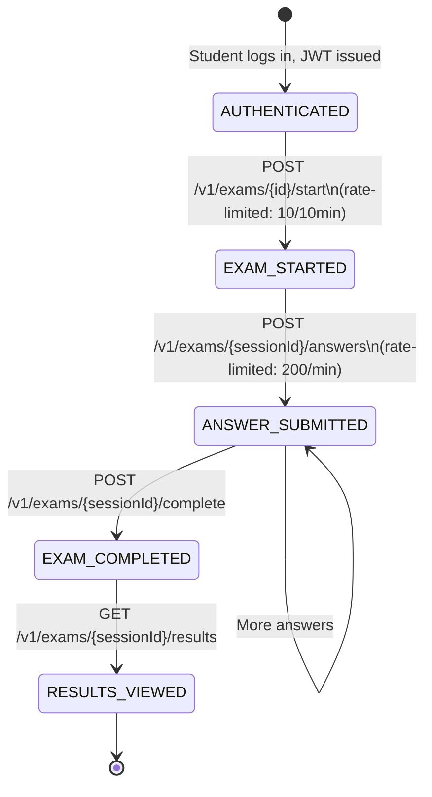

# LLD — Exam Engine on Azure

**Project:** NAPLANPrep  
**Version:** 1.0  
**Date:** 2026-08-16  
**Status:** Draft — Pre-Implementation

---

## 1. Overview

The NAPLANPrep exam engine is the core business component responsible for:
- Serving the 320-exam NAPLAN-aligned catalogue to authenticated students
- Managing exam session lifecycle (start, answer submission, completion, result delivery)
- Enforcing package-tier access control (FREE / ADVANCED / PREMIUM)
- Rate-limiting exam-related endpoints to prevent abuse

This document describes how these capabilities are deployed and operate on Azure Container Apps.

---

## 2. Exam Catalogue Invariants

These invariants are verified at startup by `DbIntegrityHealthIndicator` and by the CI DB integrity gate after every deployment. They must never change.

| Invariant | Expected Value |
|---|---|
| Published exams (total) | 320 |
| Year 3 exams | 80 |
| Year 5 exams | 80 |
| Year 7 exams | 80 |
| Year 9 exams | 80 |
| FREE package exams | 20 |
| ADVANCED package exams | 100 |
| PREMIUM package exams | 200 |
| Year/domain pair consistency errors | 0 |
| Published exams without questions | 0 |
| Spelling audio responses (should be 0 — SHORT_ANSWER post-V379) | 0 |
| Flyway migration version count (V54–V379) | 326 |

**ABSOLUTE RULE:** V54–V379 migration files must NEVER be modified. The exam content is baked into database migrations and is immutable in production.

---

## 3. Question API Security

### 3.1 Student API (`GET /v1/content/questions`)

Returns `QuestionSummary` DTO, which **excludes**:
- `correctAnswer`
- `markingRubric`
- `explanation`
- `transcript`

Access control: `@PreAuthorize("hasRole('STUDENT') or hasRole('TEACHER') or hasRole('PLATFORM_ADMIN')")`

The annotation is verified by `ContentControllerAuthTest` via reflection on every CI run. Any removal of this annotation will fail the test suite.

### 3.2 Admin API (`GET /v1/content/questions` with PLATFORM_ADMIN)

Admin-only endpoints return the full `Question` entity including answer keys. These endpoints must never be accessible to STUDENT-role tokens.

---

## 4. Exam Session Lifecycle



### 4.1 Exam Start Rate Limiting

Endpoint: `POST /v1/exams/{id}/start`  
Bucket: `EXAM_START` — 10 requests per 10 minutes per client IP  
Redis key: `ratelimit:EXAM_START:{ip}:{windowId}`  
Window: 600 seconds  

This prevents students from rapidly restarting exams to hunt for answers by repeated attempts.

### 4.2 Exam Operations Rate Limiting

Endpoints: `/v1/exams/**` (excluding `/start`)  
Bucket: `EXAM_OPS` — 200 requests per 60 seconds per client IP  
Redis key: `ratelimit:EXAM_OPS:{ip}:{windowId}`  

### 4.3 Rate Limit Redis Key Calculation

```java
long windowId = System.currentTimeMillis() / (group.windowSeconds * 1000L);
String key = "ratelimit:" + group.name() + ":" + ip + ":" + windowId;
Long count = stringRedisTemplate.opsForValue().increment(key);
if (count == 1L) {
    stringRedisTemplate.expire(key, Duration.ofSeconds(group.windowSeconds + 1));
}
```

IP is always `request.getRemoteAddr()`. With `server.forward-headers-strategy: NATIVE`, Tomcat's `RemoteIpValve` has already resolved this to the actual client IP before the interceptor runs.

---

## 5. Package Tier Access Control

| Package | Exam Access |
|---|---|
| No subscription (free tier) | 20 FREE exams only |
| ADVANCED | 100 exams (FREE + ADVANCED) |
| PREMIUM | 200 exams (all non-free + free) |

Access control is enforced at the service layer via the student's active subscription record. The subscription state is derived from the database (not from the JWT payload) so a subscription cancellation takes effect on the next request without requiring a new token.

---

## 6. Caching on Azure

### 6.1 Cache Configuration

| Cache Name | TTL | Backend | Content |
|---|---|---|---|
| `userDetails` | 5 min | Azure Managed Redis | UserDetails for JWT validation |
| `questions` | 30 min | Azure Managed Redis | Question catalogue (QuestionSummary DTOs) |
| `examCatalog` | 2 min | Azure Managed Redis | Exam metadata |

### 6.2 Redis Connection (Azure Managed Redis)

The `JwtAuthenticationFilter` handles Redis failure gracefully — if the blacklist check throws, it logs the error and falls through to the cryptographic JWT validation. A Redis outage does not block all authentication.

Rate limiting also handles Redis failure gracefully — if Redis is unavailable, the interceptor allows the request and logs the error. This is a deliberate availability-over-rate-limiting tradeoff; a Redis outage should not take the application down.

### 6.3 Cache Warming

At startup, the exam catalogue and question bank are NOT preloaded. They populate on first request and are cached for their respective TTLs. For Azure Container Apps with multiple replicas, each replica caches independently into the shared Azure Managed Redis cluster.

---

## 7. Audio Content (Spelling Domain)

**AUDIO_PRODUCTION_READY = NO**

Spelling domain questions use `SHORT_ANSWER` type post-migration V379. All `audioUrl` fields are NULL. The DB integrity gate enforces `audio_response_spelling = 0`.

No audio streaming is implemented. No Azure Blob Storage audio URL generation is included in the exam engine. This is deferred post-Phase 19.

---

## 8. Container App Scaling for Exam Load

The exam engine runs on Azure Container Apps with the following scaling rules:

```bash
az containerapp update \
  --name npp-prod-ca-api \
  --resource-group npp-prod-rg-app \
  --min-replicas 2 \
  --max-replicas 10 \
  --scale-rule-name http-scale \
  --scale-rule-type http \
  --scale-rule-http-concurrency 50
```

| Parameter | Value | Reason |
|---|---|---|
| Min replicas | 2 | No cold starts; one replica can fail without outage |
| Max replicas | 10 | Limit cost during unexpected load spikes |
| Scale trigger | HTTP concurrency 50 | Scale out when avg concurrent requests per replica hits 50 |
| CPU | 1.0 vCPU | JVM needs at least 1 full core for GC + request threads |
| Memory | 2 Gi | JVM heap 512m + metaspace + caches |

---

## 9. Database Schema for Exam Engine

The exam engine uses read-heavy query patterns on:
- `exams` table (320 rows, near-static)
- `questions` table (thousands of rows, near-static)
- `exam_sessions` table (append-heavy, student activity)
- `student_answers` table (append-heavy, one row per question per session)
- `subscriptions` table (read on every exam access, updated by Stripe webhooks)

### 9.1 Azure PostgreSQL Optimisations

```sql
-- Indexes that must exist for exam engine performance
-- These should be in Flyway migrations (V380+), NOT in V54–V379

-- Student subscriptions lookup (per-request)
CREATE INDEX IF NOT EXISTS idx_subscriptions_student_status
  ON subscriptions(student_id, status, package_type);

-- Exam catalogue by year/domain/package
CREATE INDEX IF NOT EXISTS idx_exams_year_domain_package
  ON exams(year_level, domain, package_type, status);

-- Exam session lookup by student
CREATE INDEX IF NOT EXISTS idx_exam_sessions_student
  ON exam_sessions(student_id, started_at DESC);
```

### 9.2 Connection Pool (Azure)

```yaml
spring:
  datasource:
    hikari:
      maximum-pool-size: 20      # Container App max 10 replicas × 20 = 200 max connections
      minimum-idle: 5
      connection-timeout: 30000
      idle-timeout: 600000
      max-lifetime: 1800000
      keepalive-time: 60000      # Prevents idle connections being killed by Azure FW
```

Azure PostgreSQL Flexible Server max_connections = 500 (General Purpose 4 vCores). 200 application connections leaves headroom for admin tools and monitoring.

---

## 10. Health Checks

### 10.1 `DbIntegrityHealthIndicator`

Protected endpoint: `GET /actuator/health/dbIntegrity`  
Auth required: PLATFORM_ADMIN JWT  
Checked by: CI DB integrity gate after every deployment  

The indicator runs a series of COUNT queries against the database. If any count mismatches the expected value, the health status is DOWN and the CI gate fails.

```java
// Key queries executed by DbIntegrityHealthIndicator
SELECT COUNT(*) FROM exams WHERE status = 'PUBLISHED';          -- 320
SELECT COUNT(*) FROM exams WHERE status = 'PUBLISHED' AND year_level = 3;  -- 80
// ... etc.
```

### 10.2 Standard Health Endpoints

| Endpoint | Auth | Exposed via Front Door |
|---|---|---|
| `/actuator/health` | None | Yes (HTTP 200 = UP) |
| `/actuator/health/db` | when-authorized | Restricted to VNet |
| `/actuator/health/redis` | when-authorized | Restricted to VNet |
| `/actuator/health/dbIntegrity` | PLATFORM_ADMIN JWT | Restricted to VNet |
| `/actuator/info` | None | Yes |
| `/actuator/metrics` | when-authorized | Restricted to VNet |

---

## 11. Flyway Migration Safety

### 11.1 Production Configuration

```yaml
spring:
  flyway:
    enabled: true
    validate-on-migrate: true    # Always — fail if checksum mismatch
    repair-on-migrate: false     # Never in prod — must not silently overwrite failures
    out-of-order: false          # Never — enforce sequential ordering
    baseline-on-migrate: false
```

### 11.2 Migration Failure Behaviour

If a Flyway migration fails (checksum mismatch, failed SQL), the application fails to start. This is intentional — a failed migration indicates a critical data integrity issue. Container Apps will retry startup (per liveness probe configuration) and alert via Log Analytics.

### 11.3 Version Guard

The `SecurityConfigPropertiesTest` suite verifies that `repair-on-migrate: true` is not present in `application.yml` (base config). The UAT config must not have `validate-on-migrate: false` or `out-of-order: true`.
